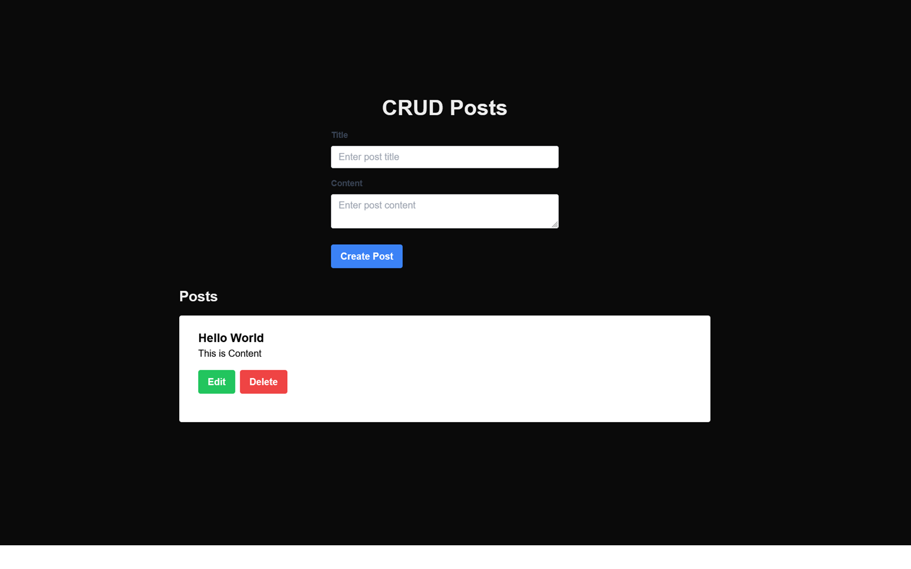

# Next.js API with Prisma and Vercel

This project demonstrates how to build a simple CRUD application for managing posts using Next.js, Prisma, and Vercel.

## Getting Started

### Prerequisites

- Node.js
- npm or yarn
- Vercel account

### Installation

1. Clone the repository:

    ```bash
    git clone https://github.com/yourusername/next-api.git
    cd next-api
    ```

2. Install the dependencies:

    ```bash
    npm install
    # or
    yarn install
    ```

3. Set up Prisma:

    ```bash
    npx prisma init
    ```

4. Configure your database in the `.env` file.

5. Generate Prisma Client:

    ```bash
    npx prisma generate
    ```

6. Run the database migrations:

    ```bash
    npx prisma migrate dev --name init
    ```

### Running the Development Server

```bash
npm run dev
# or
yarn dev
```

Open [http://localhost:3000](http://localhost:3000) with your browser to see the result.

## Deploying to Vercel

1. Push your code to a Git repository (e.g., GitHub).

2. Import your project into Vercel.

3. Set up environment variables in Vercel for your database connection.

4. Vercel will automatically deploy your project.

## CRUD Operations

### Create a Post

To create a post, send a `POST` request to `/api/posts` with the following JSON body:

```json
{
  "title": "Your Post Title",
  "content": "Your Post Content"
}
```

### Read Posts

To get all posts, send a `GET` request to `/api/posts`.

### Update a Post

To update a post, send a `PUT` request to `/api/posts/[id]` with the following JSON body:

```json
{
  "title": "Updated Post Title",
  "content": "Updated Post Content"
}
```

### Delete a Post

To delete a post, send a `DELETE` request to `/api/posts/[id]`.

## Posts

image:



## Learn More

To learn more about Next.js, Prisma, and Vercel, take a look at the following resources:

- [Next.js Documentation](https://nextjs.org/docs)
- [Prisma Documentation](https://www.prisma.io/docs)
- [Vercel Documentation](https://vercel.com/docs)

